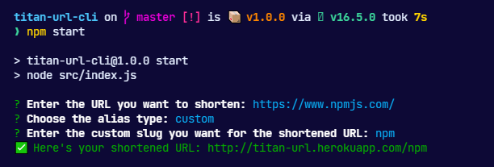

# titan-url-cli



titan-url-cli is the terminal client for [titan-url](http://titan-url.herokuapp.com).


## Installation

Via npx:
```
npx titan-url-cli
```

Via npm:
```
npm i -g titan-url-cli
```

## Related repositories

| Repo      | Description |
| ----------- | ----------- |
| [titan-url](https://github.com/Shravan-1908/titan-url)      | The titan-url website.      |
-------
